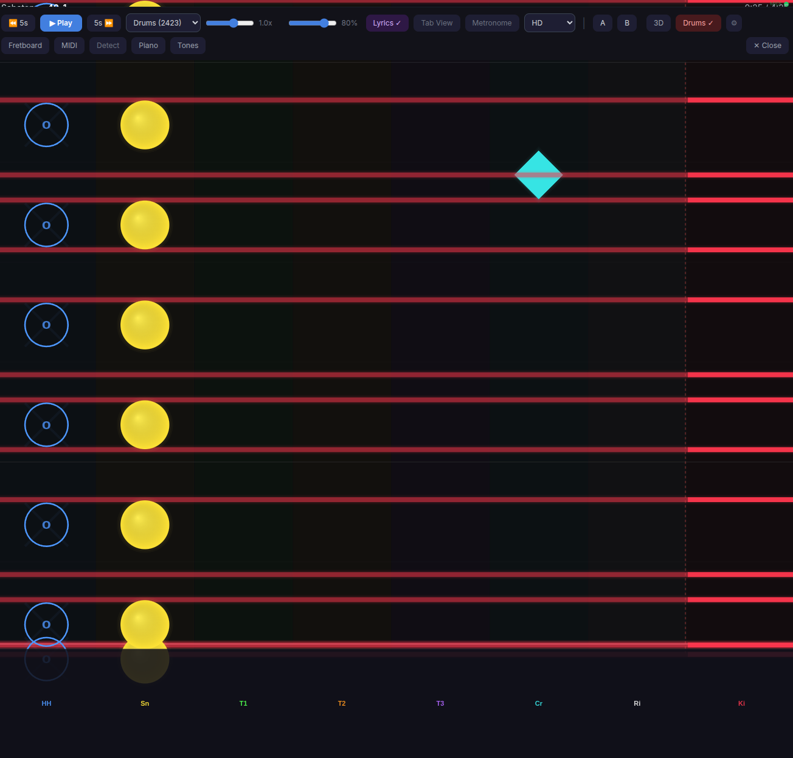

# Slopsmith Plugin: Drum Highway



A plugin for [Slopsmith](https://github.com/byrongamatos/slopsmith) that replaces the guitar highway with a lane-based drum view, with MIDI drum pad input and a built-in drum kit synthesizer.

## Features

- **Lane-based drum highway** — 8 horizontal lanes (Hi-Hat, Snare, Tom 1-3, Crash, Ride, Kick) with notes scrolling right to left
- **Kick drum full-width bars** — kick hits render as wide horizontal bars spanning the highway, like open string notes on the guitar highway
- **Distinct note shapes** — circles for toms/snare, diamonds for cymbals, X shapes for hi-hat, full bars for kick
- **Hi-hat variations** — closed (filled X), pedal (small X at bottom), open (ring with "o" inside)
- **Neon glow effects** — each drum piece has a unique color with multi-layer glow
- **Velocity-based sizing** — louder hits are bigger, ghost notes are smaller
- **Auto-activate** — switches on automatically for Drums/Percussion arrangements
- **MIDI drum pad input** — connect any MIDI drum pad, electronic kit, or controller via Web MIDI API
- **Custom MIDI mapping** — "Learn" mode to assign any MIDI note to any lane, for non-standard drum pads
- **Built-in drum sounds** — WebAudioFont-powered GM drum kit playback on MIDI hit
- **Accuracy scoring** — hit detection with tight +/-50ms timing window, accuracy %, streak counter
- **Inline settings** — MIDI device, volume, channel filter, lane labels, hit detection, and mapping table

## Drum Lanes

| Lane | Label | MIDI Notes | Color | Shape |
|------|-------|-----------|-------|-------|
| Hi-Hat | HH | 42, 44, 46 | Blue | X |
| Snare | Sn | 38, 40 | Yellow | Circle |
| Tom 1 | T1 | 48, 50 | Green | Circle |
| Tom 2 | T2 | 45, 47 | Orange | Circle |
| Tom 3 | T3 | 41, 43 | Purple | Circle |
| Crash | Cr | 49, 57 | Cyan | Diamond |
| Ride | Ri | 51, 59 | White | Diamond |
| Kick | Ki | 35, 36 | Red | Full-width bar |

## Requirements

- **Chrome or Edge** for MIDI drum pad input (Firefox does not support Web MIDI)
- MIDI features are optional — the drum view works without a MIDI controller

## Installation

```bash
cd /path/to/slopsmith/plugins
git clone https://github.com/byrongamatos/slopsmith-plugin-drums.git drums
docker compose restart
```

A "Drums" button will appear in the player controls when you play a song. Click the gear icon next to it to configure MIDI input and sound settings.

## How It Works

The plugin reads note data from the highway renderer and maps them to drum lanes. Notes use the MIDI encoding convention `midi = string * 24 + fret`, which the [editor plugin](https://github.com/byrongamatos/slopsmith-plugin-editor) uses when importing drum tracks from Guitar Pro files.

### MIDI Drum Pad

Connect a USB MIDI drum pad or electronic kit and select it from the settings panel. Play along and get real-time visual feedback:

- **Lane flash** — the lane lights up when you hit the correct drum piece
- **Green notes** — correctly hit notes within the timing window
- **Red flash** — wrong drum piece or no matching note
- **Gray notes** — missed notes that passed the now line

### Custom Mapping

Different drum pads send different MIDI note numbers. Use the "Learn" mode in settings to remap:

1. Open settings and expand "MIDI Mapping"
2. Click "Learn" next to a lane (e.g., Snare)
3. Hit the pad you want to assign to that lane
4. The MIDI note is saved to that lane

Click "Reset Map" to return to standard GM mapping.

## License

MIT
